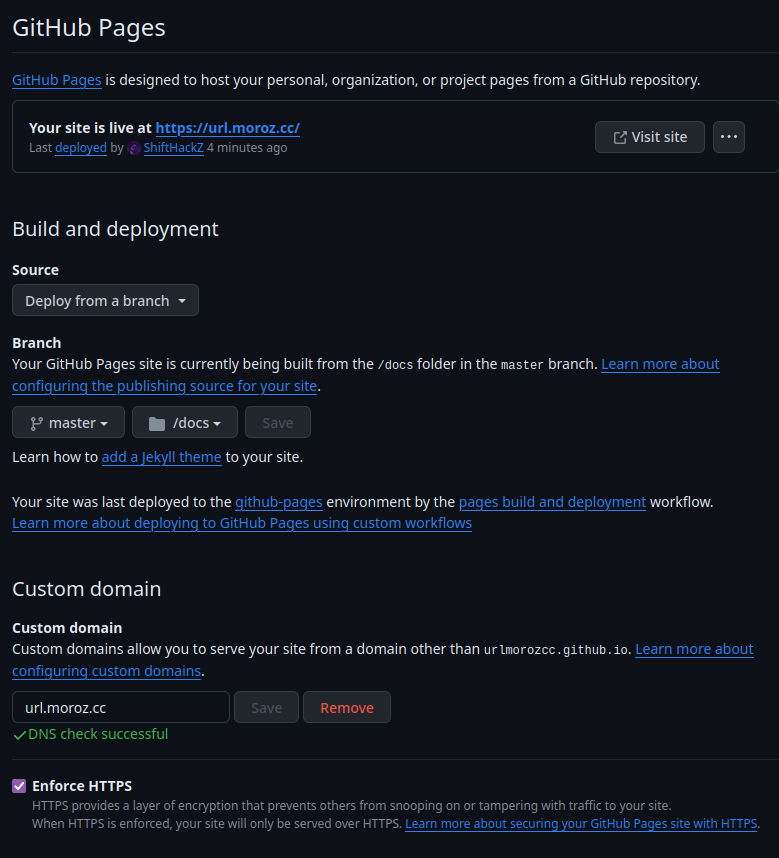

# GitHub Pages deeplink generator

This software allows to generate GitHub Pages static website that will work like URL shortener service, for example it can be used to shorten some really long URL like `https://example.com/branch/really/damn/long/url/that/is/hard/to/type/bit?behavior=bubble&bikes=book` to something more human-readable like `https://yourdomain.com/deeplink`, but the final short URL will redirect to the original URL.

The advantage of this method - is you can host your own URL shortener web service on GitHub Pages for free.

## Build instructions 

1. Download or clone this repository.

```bash
git clone https://github.com/ShiftHackZ/GP-Deeplink.git
```

Or as an option, you can fork this repository directly with your github account, and deploy it after changing the configuration.

2. Ensure your system has the `make` package to build C++ software, for example you can install it on some popular linux distros like this:

On Arch Linux based systems:

```bash
sudo pacman -S make
```

On Debian Linux based systems:

```bash
sudo apt install make
```

3. Build the `gpdeeplink` binary.

Navigate to the downloaded or cloned `GP-Deeplink` directory:

```bash
cd GP-Deeplink
```

Then build the binary:

```bash
make
```

## Custom templates

By default `default.template` is used for static deeplink generator, which just redirects the user to the destination URL. However, you can define your own custom template for every deeplink.

You can find template example [here](https://github.com/ShiftHackZ/GP-Deeplink/blob/master/templates/default.template).

## Configuration

All the configuration is done in `config.json` file.

You can find confifuration example [here](https://github.com/ShiftHackZ/GP-Deeplink/blob/master/config.json).

Parameters definition:

- `output_folder` - Defines the output folder where all of static files will be generated.
- `deeplinks` - Defines the array of all available URL deeplinks.
  - `template` - The template to use for this deeplink.
  - `deeplink` - The deepling that will be generated and appended to base GitHub pages domain, for example if you define value as __direct__, in the result the link will be __yourdomain.com/direct__.
  - `url` - The URL to use for redirect. 

## Static site generation  

The `gpdeeplink` contains the commands to operate the GitHub pages static content files for URL deeplinking service.

#### Clean output

Cleans previously generated static redirect sitemap files, removes the `output_folder` defined in configuration file.

Usage:

```bash
./gpdeeplink clean
```

#### Generate static site

Generates a deeplink redirect sitemap files based on config.

Usage:

```bash
./gpdeeplink generate
```

## Deployment 

To deploy a static site, open your forked repository, and navigate to **Settings** -> **Pages** and deploy your **/docs** folder from the main branch. Also you can configure your deployment to use a custom domain.

The example of my configuration:



## Functionality example 

As the result I created the `gpdeeplink` to redirect to this GitHub repository.

Try to click [url.moroz.cc/gpdeeplink](https://url.moroz.cc/gpdeeplink) and you will open the same repository.

Also you can view the example of how I manage my own URL shortener service based on this software [here](https://github.com/urlmorozcc/urlmorozcc).

## Credits

This if free software, provided with no warranty, you can use and modify it however you want.

If you find the idea behind this valuable, you can say thanks and show a little support, clicking the button:

[](https://www.buymeacoffee.com/shifthackz)
